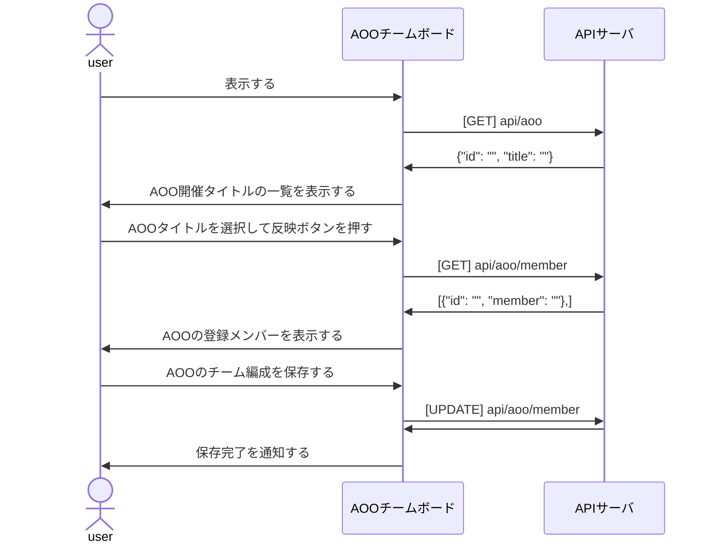

```mermaid

sequenceDiagram
    actor user
    participant aoo_teamboard as AOOチームボード
    participant server as APIサーバ

    user ->> aoo_teamboard: 表示する
    aoo_teamboard ->> server: [GET] api/aoo
    server ->> aoo_teamboard:{"id": "", "title": ""}
    aoo_teamboard ->> user: AOO開催タイトルの一覧を表示する

    user ->> aoo_teamboard: AOOタイトルを選択して反映ボタンを押す
    aoo_teamboard ->> server: [GET] api/aoo/member
    server ->> aoo_teamboard: [{"id": "", "member": ""},]
    aoo_teamboard ->> user: AOOの登録メンバーを表示する

    user ->> aoo_teamboard: AOOのチーム編成を保存する
    aoo_teamboard ->> server: [UPDATE] api/aoo/member
    server ->> aoo_teamboard : 
    aoo_teamboard ->> user: 保存完了を通知する 
    
    
```