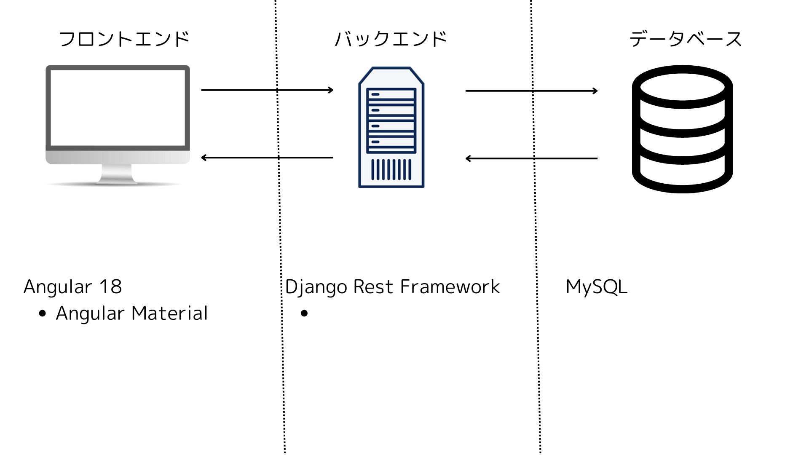
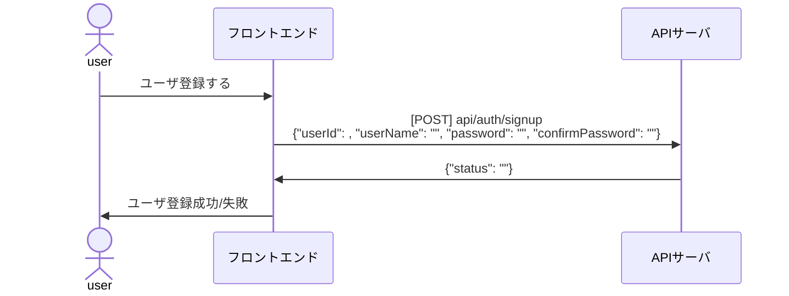
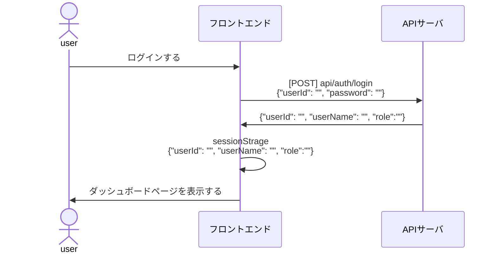
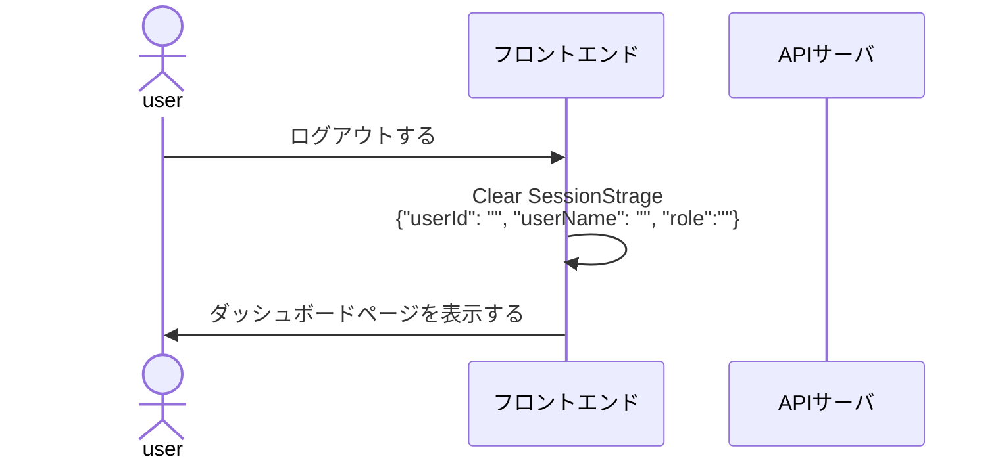
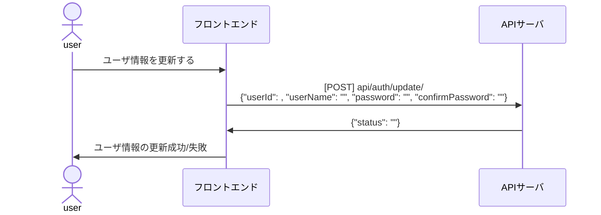
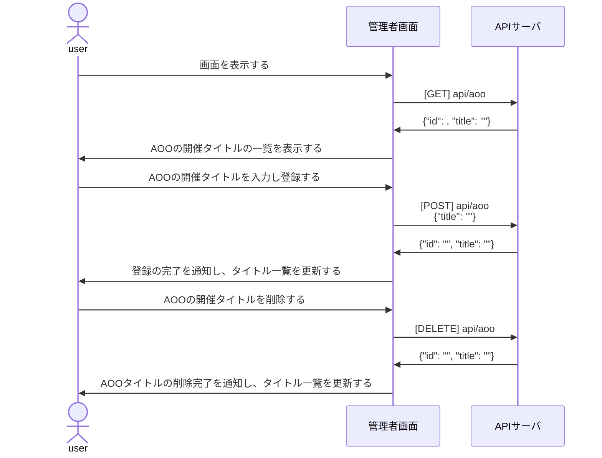
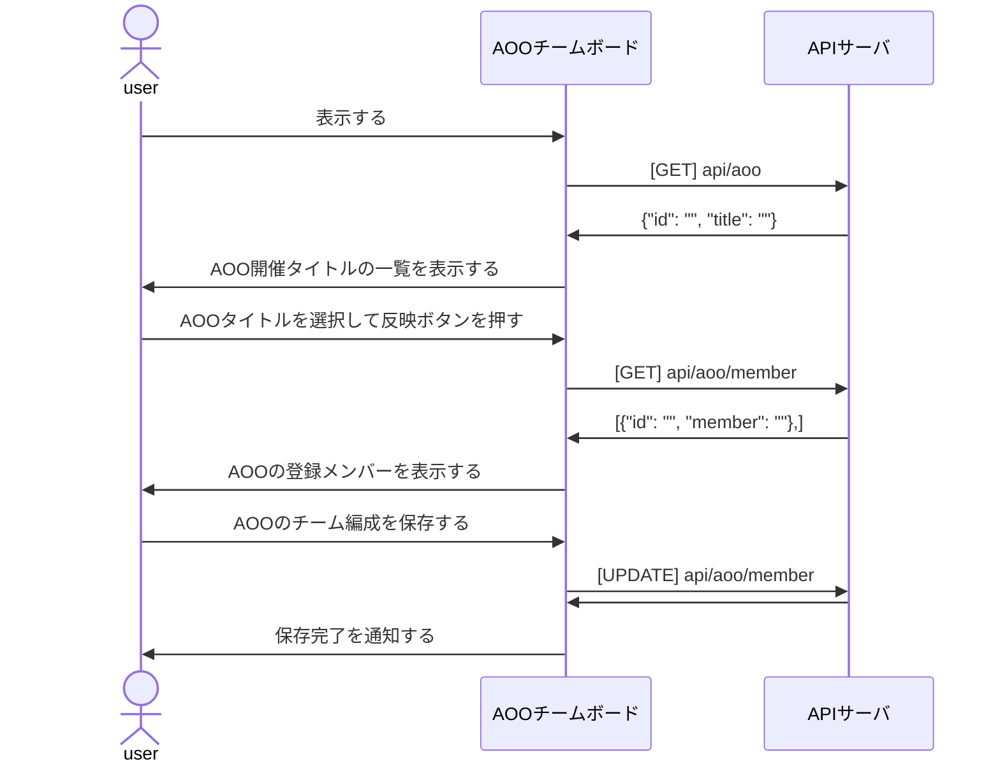

# 設計書
1. [システム設計 - ソフトウェア構成 -](#システム設計---ソフトウェア構成--)
2. [ソフトウェア設計 - 機能 -](#ソフトウェア設計---機能--)
   1. [ログインページ](#ログインページ)
      1. [機能一覧](#機能一覧)
      2. [ユーザ登録](#ユーザ登録)
      3. [ログイン](#ログイン)
      4. [ログアウト](#ログアウト)
      5. [ユーザ情報の更新](#ユーザ情報の更新)
   2. [KVK戦績登録ページ](#kvk戦績登録ページ)
   3. [AOO参加登録ページ](#aoo参加登録ページ)
      1. [機能一覧](#機能一覧-1)
         1. [シーケンス図](#シーケンス図)
      2. [入力フォーム](#入力フォーム)
      3. [シーケンス図](#シーケンス図-1)
   4. [AOO参加登録画面](#aoo参加登録画面)
      1. [AOOチームボードページ](#aooチームボードページ)
         1. [管理者が参加登録メンバーのチーム編成を作る](#管理者が参加登録メンバーのチーム編成を作る)
   5. [管理者ページ](#管理者ページ)
      1. [機能一覧](#機能一覧-2)
3. [API定義書](#api定義書)
4. [データベース設計書](#データベース設計書)
   1. [ER図](#er図)

## システム設計 - ソフトウェア構成 -

## ソフトウェア設計 - 機能 -

### ログインページ

#### 機能一覧
<table>
<tr>
<th></th>
<th></th>
</tr>
<tr>
<td></td>
<td></td>
</tr>
</table>

#### ユーザ登録

#### ログイン

#### ログアウト

#### ユーザ情報の更新

### KVK戦績登録ページ

### AOO参加登録ページ
#### 機能一覧
<table>
  <tr>
    <th>機能</th>
    <th>実装</th>
  </tr>
  <tr>
    <td>画面表示時にAOO開催タイトル一覧を表示する。</td>
    <td>✅</td>
  </tr>
  <tr>
    <td>AOO開催タイトルを編集・更新し、データベースを更新する。</td>
    <td>✅</td>
  </tr>
  <tr>
    <td>AOO開催タイトルを削除し、データベースを削除する。</td>
    <td>✅</td>
  </tr>
</table>

##### シーケンス図

#### 入力フォーム

#### シーケンス図

---
### AOO参加登録画面

<table>
  <tr>
    <th>機能</th>
    <th>実装</th>
  </tr>
  <tr>
    <td>画面表示時にAOO開催タイトル一覧を表示する。</td>
    <td>✅</td>
  </tr>
  <tr>
    <td>参加・不参加をデータベースに登録し、ステータスを表示する。</td>
    <td>✅</td>
  </tr>
</table>

#### AOOチームボードページ

<table>
  <tr>
    <th>機能</th>
    <th>実装</th>
  </tr>
  <tr>
    <td>画面表示時にAOO開催タイトル一覧を表示する。</td>
    <td>✅</td>
  </tr>
  <tr>
    <td>参加するメンバーの一覧を取得し、メンバーリストを表示する。</td>
    <td>✅</td>
  </tr>
  <tr>
    <td>更新ボタンでメンバーリストをデータベースに保存・更新する。</td>
    <td>✅</td>
  </tr>
</table>

##### 管理者が参加登録メンバーのチーム編成を作る

### 管理者ページ

#### 機能一覧

<table>
  <tr>
    <th>機能</th>
    <th></th>
  </tr>
  <tr>
    <td>ユーザ情報を管理する</td>
    <td></td>
  </tr>
    <tr>
    <td>AOO開催日を登録し、登録ページを公開する</td>
    <td></td>
  </tr>
  </tr>
    <tr>
    <td>KVKの登録ページを公開する</td>
    <td></td>
  </tr>
</table>

## API定義書

<table>
  <tr>
    <th>目的</th>
    <th>エンドポイント</th>
    <th>メソッド</th>
    <th>パラメータ</th>
    <th>response</th>
  </tr>
  <tr>
    <td>ユーザ登録する</td>
    <td>https://rok-api.betashort.com/api/auth/signup</td>
    <td>POST</td>
    <td>{"userId":"userId", "userName":"userName", "role":"role", "password":"password"}</td>
    <td>{"userId":"userId", "userName":"userName", "role":"role"}</td>
  </tr>
  <tr>
    <td>ユーザ更新する</td>
    <td>https://rok-api.betashort.com/api/auth/signup:id</td>
    <td>PUT</td>
    <td>{"userId":"userId", "userName":"userName", "role":"role", "password":"password"}</td>
    <td>{"userId":"userId", "userName":"userName", "role":"role"}</td>
  </tr>
  <tr>
    <td>ユーザ一覧を取得する</td>
    <td>https://rok-api.betashort.com/api/auth/users</td>
    <td>GET</td>
    <td></td>
    <td>{"userId":"userId", "userName":"userName", "role":"role"}</td>
  </tr>
  <tr>
    <td>ログインする</td>
    <td>https://rok-api.betashort.com/api/auth/signin</td>
    <td>POST</td>
    <td>{"userId":"userId", "userName":"userName", "role":"role", "password":"password"}</td>
    <td>{"userId":"userId", "userName":"userName", "role":"role"}</td>
  </tr>
  <tr>
    <td>KVKの戦績を登録する</td>
    <td>https://rok-api.betashort.com/api/kvk/user-result-register</td>
    <td>POST</td>
    <td>{}</td>
    <td>{"status":}</td>
  </tr>
  <tr>
    <td>KVKの戦績を更新する</td>
    <td>https://rok-api.betashort.com/kvk/user-result-update</td>
    <td>PATCH</td>
    <td>{}</td>
    <td>{}</td>
  </tr>
  <tr>
    <td>ユーザのKVKの戦績を取得する</td>
    <td>https://rok-api.betashort.com/api/kvk/user-result:id</td>
    <td>GET</td>
    <td>{}</td>
    <td>{}</td>
  </tr>
  <tr>
    <td>全ユーザのKVKの戦績を取得する</td>
    <td>https://rok-api.betashort.com/api/kvk/users-result</td>
    <td>GET</td>
    <td>{}</td>
    <td>{}</td>
  </tr>
  <tr>
    <td>全ユーザのKVKの戦績を更新する</td>
    <td>https://rok-api.betashort.com/api/kvk/users-result</td>
    <td>PATCH</td>
    <td>{}</td>
    <td>{}</td>
  </tr>
  <tr>
    <td>AOOの参加登録をする</td>
    <td>https://rok-api.betashort.com/api/aoo/user-participant</td>
    <td>PUT</td>
    <td>{}</td>
    <td>{}</td>
  </tr>
  <tr>
    <td>AOOの開催日指定で参加メンバーを取得する</td>
    <td>https://rok-api.betashort.com/api/aoo/users-participant:holdId</td>
    <td>GET</td>
    <td>{}</td>
    <td>{}</td>
  </tr>
  <tr>
    <td>AOOの開催日指定で参加メンバー情報を更新する</td>
    <td>https://rok-api.betashort.com/api/aoo/users-participant:holdId</td>
    <td>PATCH</td>
    <td>{}</td>
    <td>{}</td>
  </tr>
</table>

## データベース設計書

### ER図

