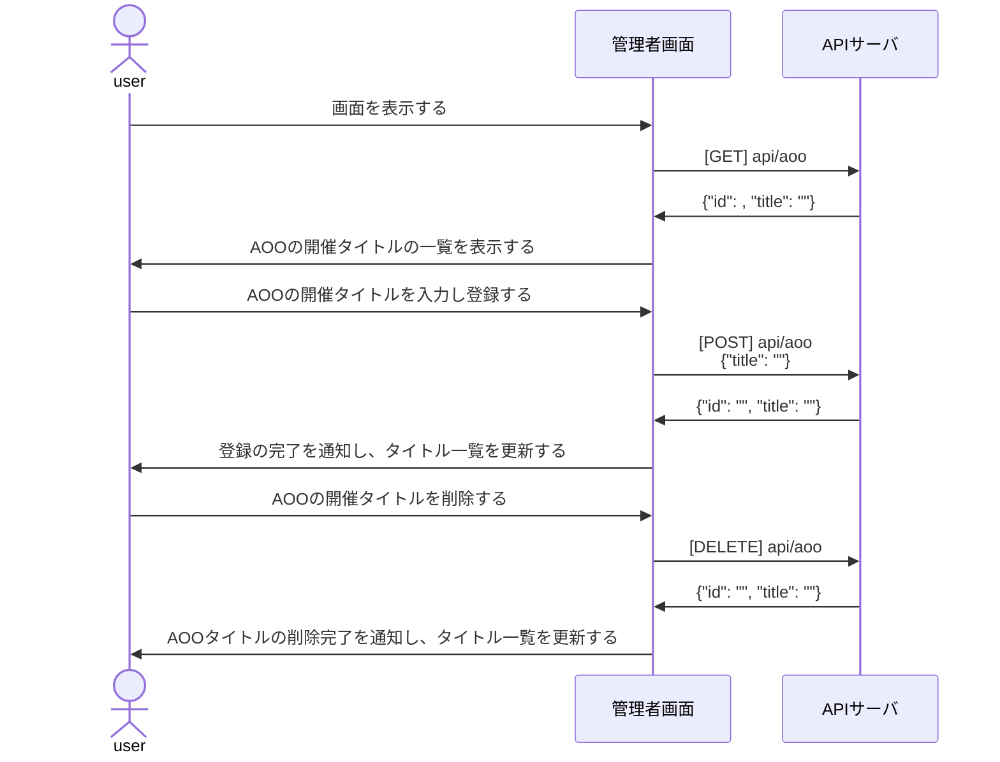
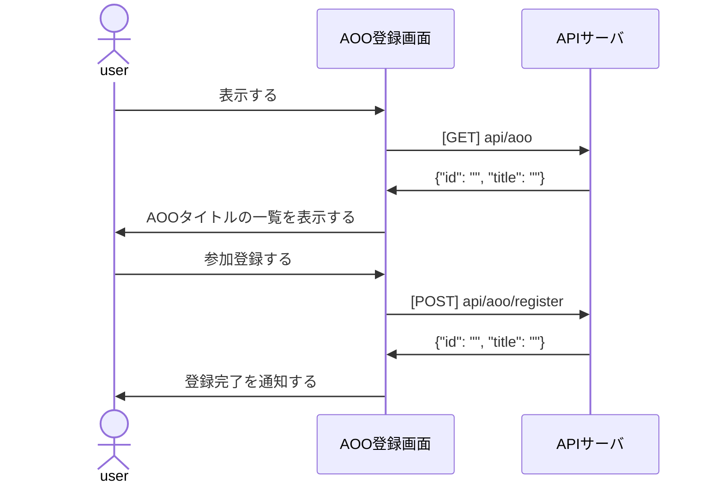
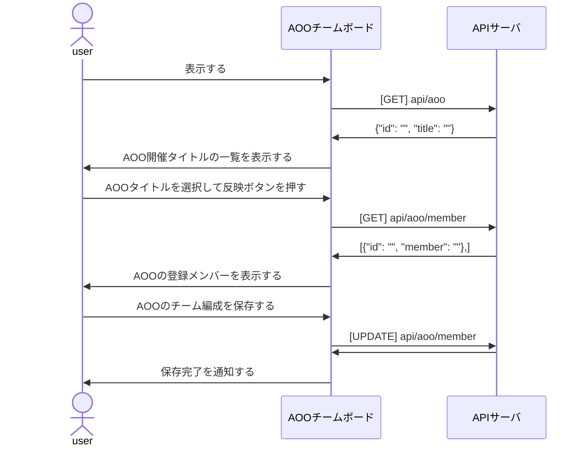

# 設計書
1. [システム設計 - ソフトウェア構成 -](#システム設計---ソフトウェア構成--)
2. [ソフトウェア設計 - 機能 -](#ソフトウェア設計---機能--)
   1. [ログインについて](#ログインについて)
   2. [KVK戦績登録について](#kvk戦績登録について)
   3. [AOO参加登録について](#aoo参加登録について)
      1. [AOO管理画面](#aoo管理画面)
         1. [シーケンス図](#シーケンス図)
      2. [AOO参加登録画面](#aoo参加登録画面)
         1. [ユーザがAOO登録画面で参加登録する](#ユーザがaoo登録画面で参加登録する)
      3. [AOOチーム管理画面](#aooチーム管理画面)
         1. [管理者が参加登録メンバーのチーム編成を作る](#管理者が参加登録メンバーのチーム編成を作る)
3. [API定義書](#api定義書)
4. [データベース設計書](#データベース設計書)
   1. [ER図](#er図)

## システム設計 - ソフトウェア構成 -

## ソフトウェア設計 - 機能 -

### ログインについて

* JWTによるトークン認証を採用する

### KVK戦績登録について

### AOO参加登録について

#### AOO管理画面

<table>
  <tr>
    <th>機能</th>
    <th>実装</th>
  </tr>
  <tr>
    <td>画面表示時にAOO開催タイトル一覧を表示する。</td>
    <td>✅</td>
  </tr>
  <tr>
    <td>AOO開催タイトルを編集・更新し、データベースを更新する。</td>
    <td>✅</td>
  </tr>
  <tr>
    <td>AOO開催タイトルを削除し、データベースを削除する。</td>
    <td>✅</td>
  </tr>
</table>

##### シーケンス図

---
#### AOO参加登録画面

<table>
  <tr>
    <th>機能</th>
    <th>実装</th>
  </tr>
  <tr>
    <td>画面表示時にAOO開催タイトル一覧を表示する。</td>
    <td>✅</td>
  </tr>
  <tr>
    <td>参加・不参加をデータベースに登録し、ステータスを表示する。</td>
    <td>✅</td>
  </tr>
</table>

##### ユーザがAOO登録画面で参加登録する

---
#### AOOチーム管理画面

<table>
  <tr>
    <th>機能</th>
    <th>実装</th>
  </tr>
  <tr>
    <td>画面表示時にAOO開催タイトル一覧を表示する。</td>
    <td>✅</td>
  </tr>
  <tr>
    <td>参加するメンバーの一覧を取得し、メンバーリストを表示する。</td>
    <td>✅</td>
  </tr>
  <tr>
    <td>更新ボタンでメンバーリストをデータベースに保存・更新する。</td>
    <td>✅</td>
  </tr>
</table>

##### 管理者が参加登録メンバーのチーム編成を作る

## API定義書

<table>
  <tr>
    <th>エンドポイント</th>
    <th>メソッド</th>
    <th>機能</th>
    <th>input</th>
    <th>response</th>
  </tr>
  <tr>
    <td></td>
    <td></td>
    <td></td>
    <td></td>
    <td></td>
  </tr>
</table>

## データベース設計書
### ER図