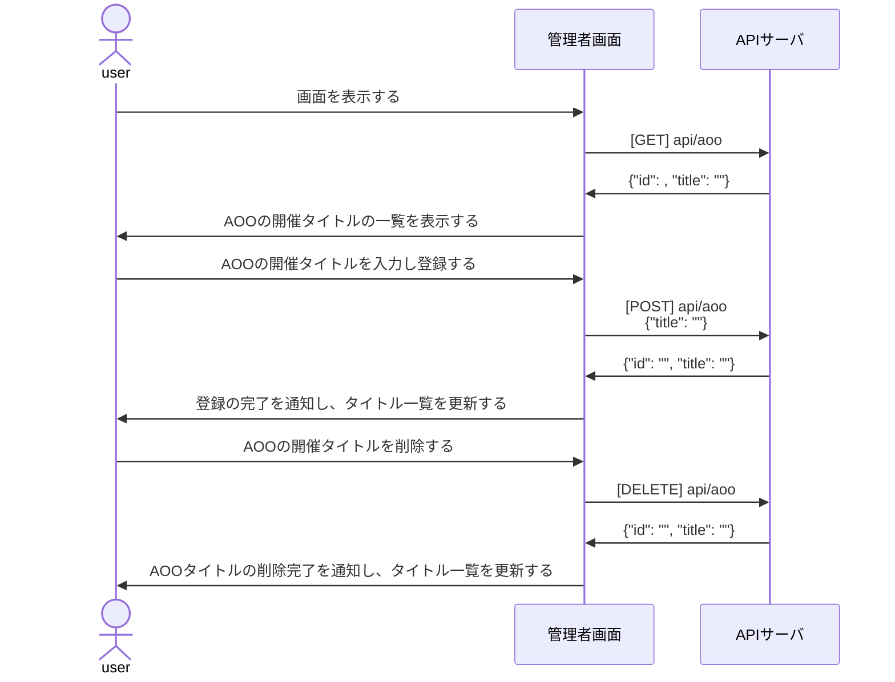
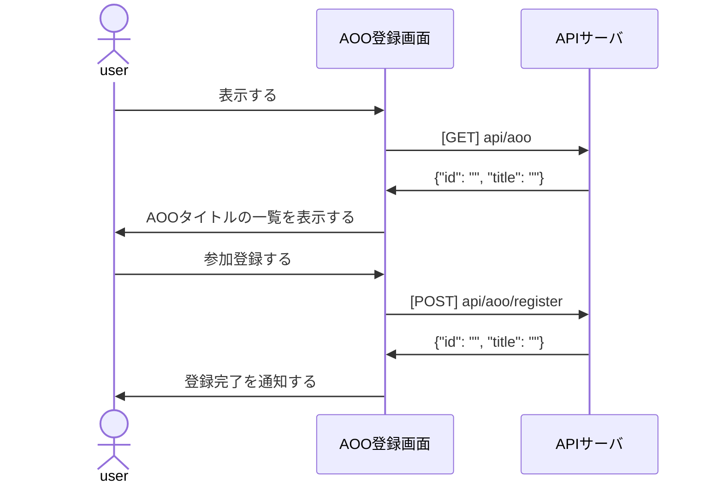
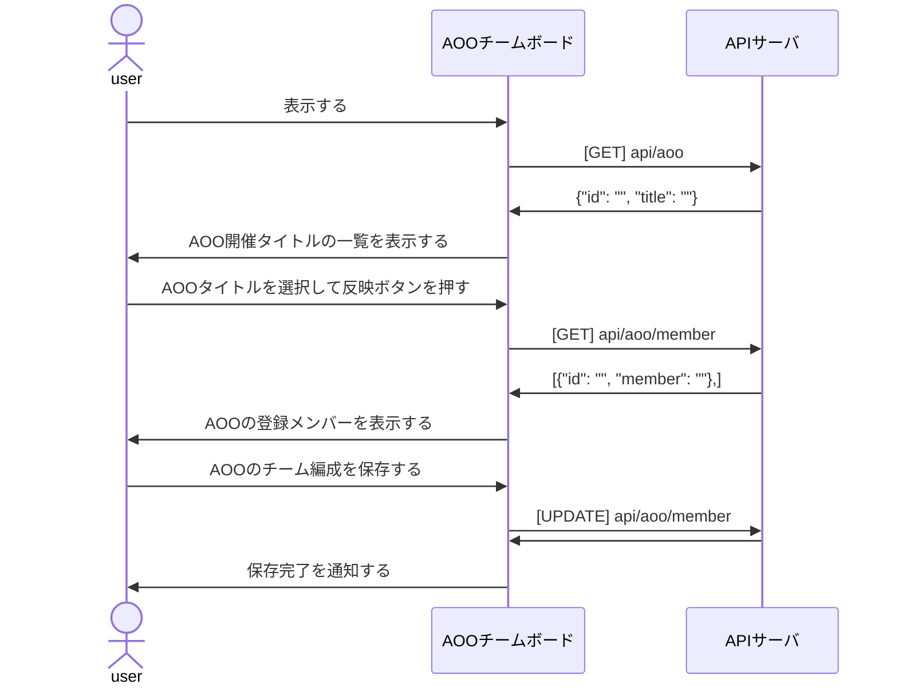

# 設計書

## 機能
<table>
 <tr>
 <th></th>
 <th></th>
 <th></th>
 <tr>
 <tr>
 <td></td>
 <td></td>
 <td></td>
 </tr>
</table>

* AOO管理画面
  * 画面表示時にAOO開催タイトル一覧を表示する。
  * AOO開催タイトルを入力・登録し、データベースに保存する。
  * AOO開催タイトルを編集・更新し、データベースを更新する。
  * AOO開催タイトルを削除し、データベースを削除する。
* AOO参加登録画面
  * 画面表示時にAOO開催タイトル一覧を表示する。
  * 参加・不参加をデータベースに登録し、ステータスを表示する。
* AOOチーム管理画面
  * 画面表示時にAOO開催タイトル一覧を表示する。
  * 参加するメンバーの一覧を取得し、メンバーリストを表示する。
  * 更新ボタンでメンバーリストをデータベースに保存・更新する。
  
### シーケンス図

#### AOO管理画面で登録する

#### ユーザがAOO登録画面で参加登録する

#### 管理者が参加登録メンバーのチーム編成を作る

## API

<table>
<tr>
<th>エンドポイント</th>
<th>メソッド</th>
<th>機能</th>
<th>input</th>
<th>response</th>
</tr>
</table>

## データベース設計書
### ER図