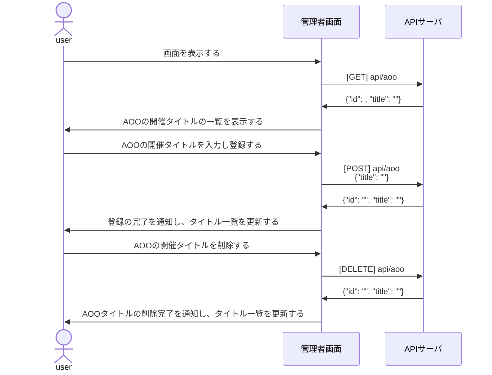

```mermaid

sequenceDiagram
    actor user
    participant admin as 管理者画面
    participant server as APIサーバ
    
    user ->> admin: 画面を表示する 
    admin ->> server: [GET] api/aoo
    server ->> admin: {"id": , "title": ""}
    admin ->> user: AOOの開催タイトルの一覧を表示する
    
    user ->> admin: AOOの開催タイトルを入力し登録する
    admin ->> server: [POST] api/aoo <br> {"title": ""}
    server ->> admin: {"id": "", "title": ""}
    admin ->> user: 登録の完了を通知し、タイトル一覧を更新する

    user ->> admin: AOOの開催タイトルを削除する
    admin ->> server: [DELETE] api/aoo
    server ->> admin: {"id": "", "title": ""}
    admin ->> user: AOOタイトルの削除完了を通知し、タイトル一覧を更新する
    
```